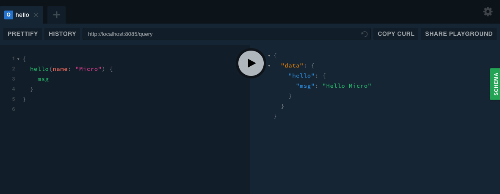

# GraphQL with gqlgen

Uses the gRPC models with a GraphQL schema.

## Dependencies

```
go get -u github.com/99designs/gqlgen github.com/vektah/gorunpkg
```

## Running the example

### 1. Start the RPC server

```
go run srv/main.go
```

### 2. Start the GraphQL server

```
go run api/graphql/main.go
```

## Query

Now you can query your GraphQL API



When a GraphQL request comes in, the gRPC handler is called with your request, according to `resolver.go` and a populated model is returned.

Basic error handling can be seen if you turn off your gRPC service and try to query.

## Making changes to the GraphQL schema

If you change the GraphQL schema file (graphql.schema), then you need to be aware of the following

`gqlgen.yml` tells gqlgen where your models are and if you don't specify, it will create them for you. In this example, I decided to use the protobuf generated models across the board. You might want to do that differently.

`resolver.go` is generated for you if you don't have it the first time. You need to implement your own resolvers. No way around that, but we have Go types for them, so that's nice.

To update your generated.go, run `gqlgen` inside graphql/graphql.
