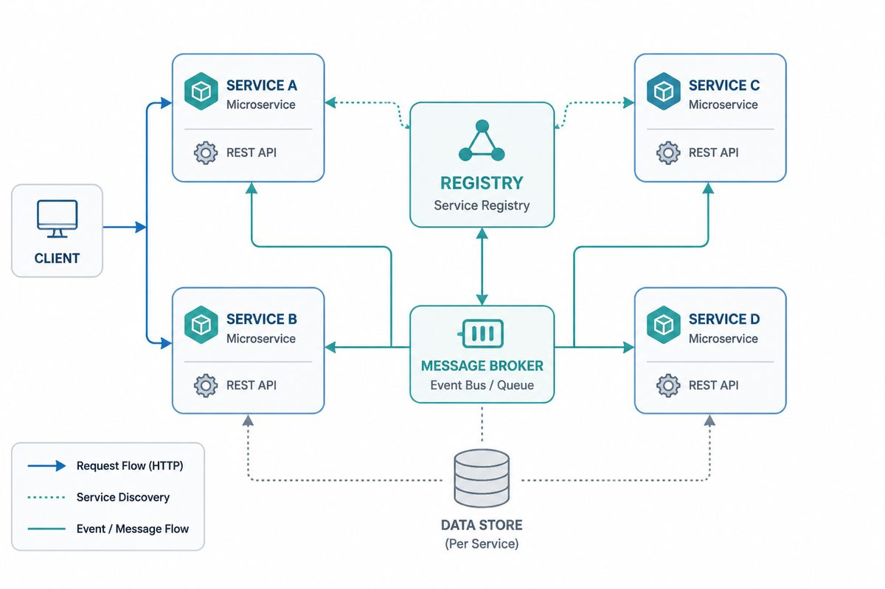

Go Micro is one runtime for the services → agents → workflows lifecycle. The same
registry, client/server RPC, store, broker, and gateway primitives that run a
service also give an agent discoverable tools, durable state, interop, and a
place to hand off deterministic work.

## Lifecycle map

```text
Services  →  Agents  →  Workflows
handlers     model loop  durable orchestration
registry     memory      triggers and ordered steps
RPC tools    guardrails   agent dispatch
```

The layers are progressive: start with a service, expose its endpoints as tools,
wrap those tools with an agent, then move the known paths into flows so the model
only handles the uncertain parts.

## Overview

Go Micro abstracts away the details of distributed systems. Here are the main features.

- **Authentication** - Auth is built in as a first class citizen. Authentication and authorization enable secure
  zero trust networking by providing every service an identity and certificates. This additionally includes rule
  based access control.

- **Dynamic Config** - Load and hot reload dynamic config from anywhere. The config interface provides a way to load application
  level config from any source such as env vars, file, etcd. You can merge the sources and even define fallbacks.

- **Data Storage** - A simple data store interface to read, write and delete records. It includes support for many storage backends
in the plugins repo. State and persistence becomes a core requirement beyond prototyping and Micro looks to build that into the framework.

- **Service Discovery** - Automatic service registration and name resolution. Service discovery is at the core of micro service
  development. When service A needs to speak to service B it needs the location of that service. The default discovery mechanism is
  multicast DNS (mdns), a zeroconf system.

- **Load Balancing** - Client side load balancing built on service discovery. Once we have the addresses of any number of instances
  of a service we now need a way to decide which node to route to. We use random hashed load balancing to provide even distribution
  across the services and retry a different node if there's a problem.

- **Message Encoding** - Dynamic message encoding based on content-type. The client and server will use codecs along with content-type
  to seamlessly encode and decode Go types for you. Any variety of messages could be encoded and sent from different clients. The client
  and server handle this by default. This includes protobuf and json by default.

- **RPC Client/Server** - RPC based request/response with support for bidirectional streaming. We provide an abstraction for synchronous
  communication. A request made to a service will be automatically resolved, load balanced, dialled and streamed.

- **Async Messaging** - PubSub is built in as a first class citizen for asynchronous communication and event driven architectures.
  Event notifications are a core pattern in micro service development. The default messaging system is a HTTP event message broker.

- **Pluggable Interfaces** - Go Micro makes use of Go interfaces for each distributed system abstraction. Because of this these interfaces
  are pluggable and allows Go Micro to be runtime agnostic. You can plugin any underlying technology.

## Service substrate

Go Micro's service framework supplies the distributed-systems base every agent
needs:

- **Registry** — services, agents, and flows register under names so clients,
  gateways, and other agents can discover them without hard-coded addresses. The
  default is mDNS for local development, with pluggable backends for production.
- **RPC client/server** — endpoints are normal Go handlers reached through the
  client, load balanced through discovery, encoded through codecs, and optionally
  streamed.
- **Broker** — asynchronous events connect services and trigger flows without
  coupling producers to consumers.
- **Config and auth** — dynamic configuration plus identity and authorization keep
  local and production runtimes using the same shape.
- **Pluggable interfaces** — registry, broker, store, transport, codecs, auth, and
  config are Go interfaces, so the runtime can stay stable while deployments swap
  infrastructure.

That substrate is intentionally not separate from the agent stack. A service
endpoint is the smallest useful unit of work, and the registry is the source of
truth for which tools and agents exist.

## Agent harness

Agents compose the service substrate with the AI-specific packages:

- **`model` / `ai.Model`** — a pluggable model interface normalizes provider calls
  while letting applications pick Anthropic, OpenAI, Gemini, Atlas Cloud, Groq,
  Mistral, Together AI, or a mock model for no-secret tests.
- **`store` / memory** — agent history, plans, run state, and compacted memory live
  in durable storage rather than in an in-process chat loop.
- **`ai.Tools`** — discovers registered service endpoints and executes them through
  the Go Micro client, so tools are generated from running services instead of a
  parallel tool registry.
- **`agent`** — runs the tool-calling loop with guardrails, planning, delegation,
  service-backed memory, and an `Agent.Chat` RPC endpoint. An agent is therefore a
  service other clients and agents can call.

The result is a harness, not just a prompt loop: model calls are bounded by tool
scope, state is recoverable, and the same CLI and gateways that reach services can
reach agents.

## Workflows

Use `flow` when the path is known or must be repeatable. Flows subscribe to broker
events, run ordered deterministic steps, and can dispatch to an agent at the point
where judgment or language understanding is needed. This keeps long-running work
observable and restartable while preserving agents for open-ended decisions.

A common shape is:

1. A service emits an event such as `ticket.created`.
2. A flow validates and enriches the event with deterministic handlers.
3. The flow dispatches to an agent for classification, drafting, or escalation.
4. The agent calls registered service tools and returns to the flow for final
   durable steps.

## Interop gateways

Gateways project the same runtime to external callers:

- **`micro api`** exposes service RPC over HTTP.
- **`micro mcp`** exposes registered service endpoints as Model Context Protocol
  tools for external agents.
- **`micro a2a`** exposes registered Go Micro agents through the Agent2Agent
  protocol and lets Go Micro flows or agents dispatch to agents hosted elsewhere.

MCP is the services-as-tools boundary; A2A is the agents-as-agents boundary. Both
come from registry metadata, so adding a service or agent updates the external
surface without duplicate wiring.

## Developer path

If you are new, follow the architecture in the same order the runtime composes it:

1. [Install troubleshooting](../guides/install-troubleshooting.md) — make sure the
   CLI, `PATH`, version, and no-secret smoke path are healthy.
2. [`micro agent demo`](../getting-started/index.md#first-agent-on-ramp) — print the
   provider-free first-agent command and next docs steps from the installed CLI.
3. `micro agent quickcheck` (or `micro agent debug`) — print the short recovery
   map when scaffold → run → chat → inspect stalls.
4. `micro examples` — list the maintained provider-free runnable examples in
   copy/paste order.
5. `micro zero-to-hero` — print the maintained one-command no-secret lifecycle
   harness and runnable examples.
6. [Examples wayfinding index](https://github.com/micro/go-micro/blob/master/examples/INDEX.md)
   — choose the smallest no-secret first-agent, support reference, and interop
   examples from one map.
7. [Smallest first-agent example](https://github.com/micro/go-micro/tree/master/examples/first-agent)
   — run one service-backed agent with a mock model.
8. [No-secret first-agent transcript](../guides/no-secret-first-agent.md) — see the
   maintained support-agent path work without a provider key.
9. [Your First Agent](../guides/your-first-agent.md) — build and chat with a
   service-backed agent.
10. [Debugging your agent](../guides/debugging-agents.md) — inspect service
    registration, tools, memory, providers, and run history.
11. [0→hero Reference](../guides/zero-to-hero.md) — walk scaffold → run → chat →
    inspect → flow → deploy dry-run as the maintained lifecycle contract.

## Related

- [AI Integration](../ai-integration/index.md) — layer-by-layer services → agents → workflows wiring
- [Getting Started](../getting-started/index.md) — first service and first-agent on-ramp
- [Examples](../examples/) — runnable examples mapped to the lifecycle
- [ADR Index](../project/architecture/) — architecture decision records
- [Configuration](../config/)
- [Plugins](../plugins.md)

## Example Usage

Here's a minimal Go Micro service demonstrating the architecture:

```go
package main

import (
    "go-micro.dev/v6"
    "log"
)

func main() {
    service := micro.NewService("example",
    )
    service.Init()
    if err := service.Run(); err != nil {
        log.Fatal(err)
    }
}
```
